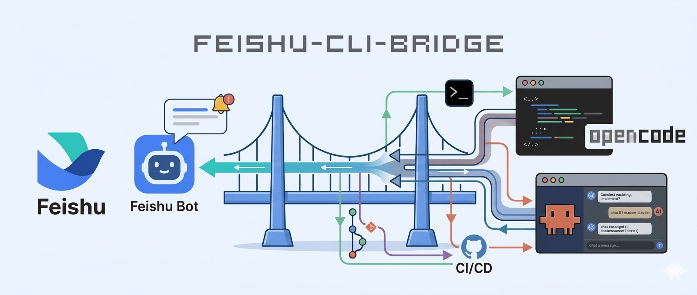

<div align="center">

<!-- Banner Image -->


<p align="center">
  <b>程序员专属：用飞书私聊向本地 CLI AI 工具下达指令，享受流式打字机输出体验</b><br>
  <i>已接入 OpenCode 与 Claude Code，支持多 CLI 工具切换</i>
</p>

<!-- Language Switch -->
<p>
  <a href="doc/README_EN.md">
    
  </a>
  <a href="#feishu-cli-bridge">
    
  </a>
</p>

<!-- Status Badges -->
<p>
  
  
  
  
</p>

<!-- Platform Support -->
<p>
  
  
  
</p>

<!-- Last Updated -->
<p>
  
</p>

</div>

---

## 📑 目录

- [🎯 使用场景](#-使用场景)
- [✨ 功能特性](#-功能特性)
- [⚡ 快速开始](#-快速开始)
  - [第一步：安装前置依赖](#第一步安装前置依赖)
  - [第二步：创建飞书企业自建应用并启用机器人](#第二步创建飞书企业自建应用并启用机器人)
  - [安装方式选择](#安装方式选择)
- [🏗️ 项目结构](#️-项目结构)
- [🔧 开发命令](#-开发命令)
- [📝 更新日志](#-更新日志)
- [📄 许可证](#-许可证)

---

## 🎯 使用场景

**单人编程辅助。** 在任意设备上打开飞书，向自己的机器人发送编程指令，机器人将指令转发给运行在本地的 CLI AI 工具执行，流式返回结果。

**支持平台**：Windows、Linux、macOS（Apple Silicon / Intel）

### 典型场景

| 场景 | 描述 |
|:-----|:-----|
| 📱 **手机查看** | 在手机上查看代码或让 AI 解释某个实现 |
| 💼 **会议间隙** | 在会议间隙发起一个后台重构任务 |
| 🔄 **上下文切换** | 切换不同项目目录，让 AI 在对应上下文中工作 |
| 🪟 **Windows 环境** | 在 Windows 开发环境中通过飞书调用本地 OpenCode |

---

## ✨ 功能特性

<table>
<tr>
<td width="50%">

### 🤖 **OpenCode 接入**
HTTP/SSE 方式，自动启动并管理 `opencode serve`，自动预授权外部目录访问（无头模式工具调用不阻塞）

### 🎭 **Claude Code 接入**
`child_process.spawn` + JSON Lines 流式解析，支持 `@filepath` 文件引用，模型动态检测（兼容 Kimi 等第三方 Provider）

### 🎭 **Agent 模式**
内置 Build / Plan 模式；自动检测 oh-my-openagent，已安装时切换为 7 个专业 Agent，`/mode` 卡片一键切换

### 🔀 **模型切换**
`/model` 卡片展示 `config.yaml` 中配置的模型列表，点击按钮即时切换，无需重启

### 💬 **CardKit 流式输出**
真正的打字机效果，100ms 节流推送；CardKit 不可用时自动降级 IM Patch（1500ms）

### 💭 **思考过程展示**
可折叠思考面板，实时显示 AI 推理过程，工具调用步骤完成后继续等待文字回复

</td>
<td width="50%">

### 📊 **Token 统计**
右对齐 Footer 紧凑显示耗时、Token 消耗、上下文占用率、模型名

### 🖼️ **图片/文件输入**
发送图片或文件自动下载并 base64 编码，作为 FilePart 传给模型视觉识别

### 📁 **项目管理**
`/pl` 交互式卡片管理多个工作目录，支持分页，点击「切换」按钮直接切换，带删除二次确认

### 🔄 **工作目录隔离**
每个项目对应独立 OpenCode session（通过 `directory` 参数），工具调用 CWD 精确隔离

### ⚡ **智能节流**
长间隙后先批处理再刷新，避免首次更新内容过少

</td>
</tr>
</table>

---

## ⚡ 快速开始

### 第一步：安装前置依赖

在开始之前，请确保已安装以下软件：

| 依赖 | 最低版本 | 用途 | 安装方式 |
|:-----|:--------|:-----|:---------|
| **Node.js** | 20+ LTS | 运行环境 | [官网下载](https://nodejs.org/) 或包管理器 |
| **Git** | 任意 | 克隆仓库 | [官网下载](https://git-scm.com/) 或包管理器 |
| **OpenCode CLI** (可选) | 0.5.0+ | AI 编程助手 | `npm install -g opencode-ai` |
| **Claude Code** (可选) | 最新版 | AI 编程助手 | `npm install -g @anthropic-ai/claude-code` |

> 💡 **重要说明**：本项目是**桥接工具**，专注于连接飞书和本地 CLI 工具。**不会自动安装** OpenCode/Claude 等 CLI 工具，配置向导只负责检测和引导。您需要**至少安装一个** CLI 工具才能使用。

#### 各平台安装指南

<details>
<summary><b>🐧 Linux（Ubuntu/Debian）</b></summary>

```bash
# 1. 安装 Node.js LTS
curl -fsSL https://deb.nodesource.com/setup_24.x | sudo -E bash -
sudo apt-get install -y nodejs

# 2. 验证 Node.js 版本
node --version  # 应显示 v20.x.x 或更高

# 3. 安装 CLI 工具（需手动安装，至少选一个）
npm install -g opencode-ai          # OpenCode
npm install -g @anthropic-ai/claude-code  # Claude Code（可选）

# 4. 验证安装
opencode --version
claude --version  # 如安装了 Claude Code
```

**常见问题**：
- 如果 `npm` 提示权限错误，尝试：`sudo npm install -g opencode-ai`
- 或者更改 npm 全局目录：[npm 文档](https://docs.npmjs.com/resolving-eacces-permissions-errors-when-installing-packages-globally)

</details>

<details>
<summary><b>🍎 macOS</b></summary>

```bash
# 1. 安装 Homebrew（如未安装）
# 访问 https://brew.sh 获取安装命令

# 2. 安装 Node.js
brew install node

# 3. 验证版本
node --version  # 应显示 v20.x.x 或更高

# 4. 安装 CLI 工具（需手动安装，至少选一个）
npm install -g opencode-ai          # OpenCode
npm install -g @anthropic-ai/claude-code  # Claude Code（可选）

# 5. 验证
opencode --version
claude --version  # 如安装了 Claude Code
```

</details>

<details>
<summary><b>🪟 Windows</b></summary>

**依次安装以下软件：**

1. **[Node.js LTS (v20+)](https://nodejs.org/en/download)**
   - 下载 Windows Installer (.msi)
   - **关键**：安装过程中勾选「**Add to PATH**」

2. **[Git for Windows](https://git-scm.com/download/win)**
   - 下载 64-bit Git for Windows Setup
   - 使用默认选项安装即可

3. **CLI 工具（至少安装一个）**
   ```powershell
   # OpenCode
   npm install -g opencode-ai
   
   # Claude Code（可选）
   npm install -g @anthropic-ai/claude-code
   ```

**重要步骤**：
> 安装完成后，**重启 PowerShell**（或 CMD），使环境变量生效。

验证安装：
```powershell
node --version      # 应显示 v20.x.x
opencode --version  # 如安装了 OpenCode
claude --version    # 如安装了 Claude Code
```

</details>

---

### 第二步：创建飞书企业自建应用并启用机器人

在开始安装本项目之前，你需要先在飞书开放平台创建应用并获取凭证：

1. **创建企业自建应用**
   - 进入[飞书开发者控制台](https://open.feishu.cn/app)，点击「创建企业自建应用」
   - 填写应用信息（名称、描述、图标）

2. **添加应用能力 → 机器人**
   - 在应用详情页左侧菜单中，选择「添加应用能力」
   - 点击「机器人」卡片，按提示完成机器人能力的开通
   - 开通后，你可以在「凭证与基础信息」页面看到 **App ID** 和 **App Secret**

3. **配置权限**

   **方式一：JSON 批量导入（推荐）**

   本项目提供了完整的权限配置文件 [`doc/feishu_permissions.json`](./doc/feishu_permissions.json)，包含所有必需的权限。操作步骤：

   ```
   权限管理 → 批量导入 → 选择 feishu_permissions.json 文件 → 确认导入
   ```

   **方式二：手动开启**

   如需手动配置，请开启以下权限：

   | 权限 scope | 用途 | 是否必需 |
   |:-----------|:-----|:--------:|
   | `im:message` | 读取消息 | ✅ |
   | `im:message:send_as_bot` | 以机器人身份发消息 | ✅ |
   | `im:message.reactions:read` | ✏️ 打字提示 | ✅ |
   | `im:message.reactions:write_only` | 添加/删除 Reaction | ✅ |
   | `im:resource` | 下载图片/文件 | ✅ |
   | `contact:user.id:readonly` | 读取用户 ID | ✅ |
   | `cardkit:card:read` / `cardkit:card:write` | CardKit 流式卡片 | ❌ |

   > 💡 **提示**：如果不开启 CardKit 权限，系统会自动降级使用 IM Patch 模式（1500ms 刷新间隔），核心功能不受影响。

4. **发布应用**

   **版本管理与发布** → 创建版本 → 填写版本信息 → 发布

   > 内部应用无需审核，发布后立即生效。

5. **记录凭证**

   进入「凭证与基础信息」页面，记录以下信息（后续配置需要）：
   - **App ID**（格式：`cli_xxxxxxxxxxxxxxxx`）
   - **App Secret**

   > 📝 **重要提示**：每次修改权限后，必须创建新版本并发布才能生效。

---

### 安装方式选择

安装本项目有两种方式，选择适合你的：

| 方式 | 适用场景 | 复杂度 |
|:-----|:---------|:-------|
| **一键安装脚本** | 快速开始，自动完成大部分配置 | ⭐ 简单 |
| **手动克隆安装** | 开发者，需要自定义配置 | ⭐⭐ 中等 |

#### 方式一：一键安装脚本（推荐）

> ⚠️ **前置要求**：
> 1. 已安装 Node.js 20+ 和 Git（脚本仅检测不会自动安装）
> 2. 已完成上方「第二步：创建飞书企业自建应用」并获取到 **App ID** 和 **App Secret**

<details>
<summary><b>🐧 Linux / 🍎 macOS</b></summary>

```bash
curl -fsSL -o /tmp/setup.sh https://raw.githubusercontent.com/403-Forbidde/feishu-cli-bridge/main/scripts/setup.sh
bash /tmp/setup.sh
```

脚本会：
1. **检测** Node.js 版本（要求 20+）
2. **检测** Git 是否安装
3. 克隆仓库到 `~/feishu-cli-bridge`
4. 安装 npm 依赖
5. 启动交互式配置向导

> 如果缺少前置依赖，脚本会显示安装指南并退出。

</details>

<details>
<summary><b>🪟 Windows (PowerShell)</b></summary>

```powershell
powershell -ExecutionPolicy Bypass -Command "iex (irm https://raw.githubusercontent.com/403-Forbidde/feishu-cli-bridge/main/scripts/setup.ps1)"
```

> `-ExecutionPolicy Bypass` 仅作用于当前进程，用于允许执行远程脚本。

脚本会：
1. **检测** Node.js 和 Git 是否已安装（运行前必须先安装）
2. 克隆仓库
3. 安装 npm 依赖
4. 启动交互式配置向导

> 如果缺少前置依赖，脚本会显示安装指南并退出。

</details>

**配置向导流程**：

```
┌─────────────────────────────────────────────────────────┐
│  1. CLI 工具检测                                         │
│     └─ 未安装 → 显示安装命令 → 等待手动安装 → 重新检测    │
│     └─ 已安装 → 检查登录状态 → 提示登录（如未登录）        │
│                                                         │
│  2. 模型选择（**必须选择**）                              │
│     ├─ 读取用户 OpenCode 配置 → 是否已有默认模型？        │
│     │   ├─ 是 → 询问使用现有配置或重新选择                │
│     │   └─ 否 → 从 OpenCode 获取当前可用模型列表          │
│     └─ 用户必须选择模型（无硬编码默认值）                 │
│                                                         │
│  3. 飞书配置                                            │
│     └─ 输入 App ID / App Secret → 验证格式              │
│                                                         │
│  4. 服务配置（可选）                                     │
│     └─ 生成 systemd/launchd/Windows 服务配置             │
└─────────────────────────────────────────────────────────┘
```

> 💡 **注意**：配置向导**不会自动安装 CLI 工具**，只负责检测和引导。如果未检测到，会显示安装命令供你手动执行。
>
> 💡 **模型选择**：向导首先会读取你现有的 OpenCode 默认模型配置。如果未设置，则**必须**从当前可用模型列表中选择。免费模型列表是动态获取的，可能随时间变化——不会使用任何硬编码默认值。

---

#### 方式二：手动克隆安装

> ⚠️ **前置要求**：已完成上方「第二步：创建飞书企业自建应用」并获取到 **App ID** 和 **App Secret**。

如果你选择手动安装，请按以下步骤操作：

##### 步骤 1：克隆项目 & 安装依赖

```bash
# 从 GitHub 克隆仓库
git clone https://github.com/403-Forbidde/feishu-cli-bridge.git
cd feishu-cli-bridge

# 安装依赖
npm install
```

> 💡 **关于配置向导**：如果你希望运行与一键安装相同的交互式配置向导，可执行 `npm run setup:dev`。你也可以直接手动编辑 `config.yaml` 完成配置。

> 💡 **关于 CLI 工具**：本项目是桥接工具，**不会自动安装** OpenCode 等 CLI 工具。向导只会检测并引导你已安装的本地环境。

---

##### 步骤 2：配置项目（填入飞书凭证）

复制配置文件模板并编辑：

```bash
cp config.example.yaml config.yaml   # Windows: copy config.example.yaml config.yaml
```

打开 `config.yaml`，填写飞书凭据（**只有这两项是必填的**）：

```yaml
feishu:
  app_id: "cli_xxxxxxxxxxxxxxxx"
  app_secret: "xxxxxxxxxxxxxx"
```

也可以不创建配置文件，直接用环境变量：

<details>
<summary><b>🐧 Linux / macOS</b></summary>

```bash
export FEISHU_APP_ID="cli_xxx"
export FEISHU_APP_SECRET="xxx"
```

</details>

<details>
<summary><b>🪟 Windows CMD（临时）</b></summary>

```cmd
set FEISHU_APP_ID=cli_xxx
set FEISHU_APP_SECRET=xxx
```

</details>

---

##### 步骤 3：启动（根据安装方式选择）

如果你使用**一键安装脚本**，向导结束后可直接启动服务。  
如果你使用**手动克隆安装**，请通过以下方式启动：

###### 开发模式（热重载）

```bash
npm run dev
```

###### 生产模式

```bash
npm run build
npm start
```

启动成功后日志会显示 `🚀 Feishu CLI Bridge 启动成功！`。收到第一条飞书消息时，桥接程序会自动启动 `opencode serve`，无需手动操作。

---

##### 步骤 4：配置事件订阅（项目启动后）

项目启动后，返回飞书开发者控制台配置事件订阅：

1. 进入你的应用详情页
2. **事件与回调** → 连接方式选择「**长连接**」
3. 点击「添加事件」，选择 `im.message.receive_v1`
4. 点击「保存」

> 💡 **为什么现在才配置**：长连接模式需要你的服务已经运行才能建立连接。
> 
> 💡 **无需配置卡片回调 URL**：长连接模式会自动接收卡片按钮点击事件，不需要填写回调地址。

配置完成后，在飞书客户端中找到你的机器人，发送一条消息测试连接。如果一切正常，机器人会回复你。

---

### 后台运行（可选）

<details>
<summary><b>🐧 Linux — systemd 用户服务（推荐，开机自启）</b></summary>

创建 `~/.config/systemd/user/feishu-cli-bridge.service`：

```ini
[Unit]
Description=Feishu CLI Bridge
After=network.target

[Service]
Type=simple
WorkingDirectory=%h/feishu-cli-bridge
ExecStart=/usr/bin/npm start
Restart=on-failure
RestartSec=5

[Install]
WantedBy=default.target
```

然后执行：

```bash
systemctl --user daemon-reload
systemctl --user enable --now feishu-cli-bridge
systemctl --user status feishu-cli-bridge
journalctl --user -u feishu-cli-bridge -f
```

</details>

<details>
<summary><b>📦 使用 PM2</b></summary>

```bash
npm install -g pm2
pm2 start npm --name "feishu-bridge" -- start
pm2 save
pm2 startup
```

</details>

<details>
<summary><b>🍎 macOS — nohup（推荐配合 tmux）</b></summary>

```bash
npm run build
nohup npm start > bridge.log 2>&1 &
```

</details>

<details>
<summary><b>🪟 Windows — 任务计划程序（开机自启）</b></summary>

```cmd
schtasks /create /tn "FeiShuBridge" /tr "cmd /c cd /d C:\path\to\feishu-cli-bridge && npm start" /sc onlogon /ru %USERNAME% /f
schtasks /end    /tn "FeiShuBridge"   & REM 停止
schtasks /delete /tn "FeiShuBridge" /f  & REM 卸载
```

> 在 CMD/PowerShell 中运行 `npm start` 前，先执行 `chcp 65001`，可避免中文日志乱码。

</details>

---

### 🎮 TUI 命令

#### 会话 & 模型

| 命令 | 说明 |
|:-----|:-----|
| `/new` | 创建新会话 |
| `/session` | 列出最近会话，以交互式卡片回复，支持切换/重命名/删除 |
| `/model` | 列出可用模型（卡片），点击按钮切换；模型列表在 `config.yaml` 中维护 |
| `/mode` | 列出 Agent 模式，点击卡片按钮切换（Build / Plan / oh-my-openagent） |
| `/mode <agent>` | 直接切换到指定 Agent 模式 |
| `/reset` 或 `/clear` | 清空当前会话上下文 |
| `/stop` | 强制停止当前 AI 输出 |
| `/help` | 显示帮助 |

#### 项目管理

| 命令 | 说明 |
|:-----|:-----|
| `/pa <路径> [名称]` | 添加已有目录为项目 |
| `/pc <路径> [名称]` | 创建新目录并添加为项目 |
| `/pl` | 列出所有项目（交互式卡片，支持分页与切换按钮） |
| `/ps <标识>` | 切换到指定项目 |
| `/prm <标识>` | 从列表移除项目（不删除目录） |
| `/pi [标识]` | 查看项目信息 |

切换项目后，AI 工具调用（`bash`/`read_file` 等）将在对应目录执行。`/pl` 返回交互式卡片，点击按钮可直接切换，无需手动输入命令。

**示例：**

```
/pa ~/code/my-app myapp 我的应用   # 添加并命名
/pl                                 # 查看项目列表（卡片带切换按钮）
/ps myapp                           # 命令行方式切换
/pi                                 # 查看当前项目信息
```

---

## 🏗️ 项目结构

```
feishu-cli-bridge/
├── src/
│   ├── core/                  # 🔧 核心基础设施
│   │   ├── config.ts          # 配置管理（YAML + 环境变量）
│   │   ├── logger.ts          # Pino 日志
│   │   ├── retry.ts           # 指数退避重试
│   │   └── types/             # 共享类型定义
│   │       ├── config.ts
│   │       ├── stream.ts
│   │       └── index.ts
│   │
│   ├── adapters/              # 🔌 CLI 适配器层
│   │   ├── interface/         # 抽象接口
│   │   │   ├── base-adapter.ts
│   │   │   └── types.ts
│   │   ├── factory.ts         # 适配器工厂
│   │   ├── index.ts           # 适配器注册
│   │   └── opencode/          # OpenCode 适配器
│   │       ├── adapter.ts     # 主适配器
│   │       ├── http-client.ts # HTTP 客户端
│   │       ├── sse-parser.ts  # SSE 流解析
│   │       ├── server-manager.ts
│   │       ├── session-manager.ts
│   │       └── types.ts
│   │
│   ├── platform/              # 📱 飞书平台层
│   │   ├── feishu-client.ts   # WebSocket 客户端
│   │   ├── feishu-api.ts      # HTTP API 封装
│   │   ├── message-processor/ # 消息处理
│   │   │   ├── index.ts
│   │   │   ├── router.ts
│   │   │   ├── ai-processor.ts
│   │   │   ├── command-processor.ts
│   │   │   └── attachment-processor.ts
│   │   ├── streaming/         # 流式系统
│   │   │   ├── controller.ts
│   │   │   ├── flush-controller.ts
│   │   │   └── types.ts
│   │   └── cards/             # 卡片构建
│   │       ├── streaming.ts
│   │       ├── complete.ts
│   │       ├── session-cards.ts
│   │       ├── project-cards.ts
│   │       ├── error.ts
│   │       └── utils.ts
│   │
│   ├── card-builder/          # 🎨 TUI 卡片构建
│   │   ├── base.ts
│   │   ├── interactive-cards.ts
│   │   ├── project-cards.ts
│   │   ├── session-cards.ts
│   │   ├── constants.ts
│   │   └── utils.ts
│   │
│   ├── tui-commands/          # ⌨️ TUI 命令
│   │   ├── index.ts
│   │   ├── base.ts
│   │   ├── opencode.ts
│   │   └── project.ts
│   │
│   ├── project/               # 📁 项目管理
│   │   ├── manager.ts
│   │   ├── types.ts
│   │   └── index.ts
│   │
│   ├── session/               # 💾 会话管理
│   │   ├── manager.ts
│   │   ├── types.ts
│   │   └── index.ts
│   │
│   └── main.ts                # 🚀 入口
│
├── scripts/                   # 🛠️ 脚本工具
├── config.example.yaml        # 📝 配置模板
├── package.json
├── tsconfig.json
├── vitest.config.ts
├── README.md                  # 🇨🇳 中文文档（本文件）
└── doc/                       # 文档目录
    ├── CHANGELOG.md           # 版本更新日志
    ├── README_EN.md           # 🇬🇧 英文文档
    ├── ROADMAP.md             # 项目路线图
    └── feishu_permissions.json # 飞书机器人权限配置（开发者后台导入）
```

---

## 🔧 开发命令

```bash
# 📦 安装依赖
npm install

# 🔥 开发模式（热重载）
npm run dev

# ✅ 类型检查
npm run typecheck

# 🔍 代码检查
npm run lint

# 🏗️ 构建
npm run build

# 🚀 生产运行
npm start

# 🧪 测试
npm run test
```

---

## 📝 更新日志

### v0.3.0 (2026-04-03) — Claude Code 适配器支持（当前版本）

- 🤖 **Claude Code 支持** — 全新 Claude Code CLI 适配器，生产就绪
- 🔄 **双 CLI 支持** — 同时支持 OpenCode 与 Claude Code，自由切换
- 📝 **文件引用** — 支持 `@filepath` 语法引用图片/文件
- 🎯 **模型动态检测** — 自动识别 Claude Code 实际使用的模型（支持 Kimi 等第三方 Provider）
- 🧪 **全面测试** — 61 个单元测试覆盖 Claude Code 适配器

### v0.2.1 (2026-04-02) — TypeScript 重写

- 🔧 **全面迁移** — 从 Python 迁移至 TypeScript/Node.js
- 🏗️ **架构升级** — 分层架构：Core → Platform → Adapter
- 🔒 **类型安全** — 严格的 TypeScript 类型定义
- ⚡ **性能优化** — HTTP 连接池复用、智能节流
- 🛡️ **安全加固** — 路径遍历防护、输入验证
- 🎯 **功能完整** — 100% 功能对标 Python 版本
- 🎴 **TUI 统一卡片化** — 所有 TUI 命令（`/session`、`/model`、`/pl` 等）均以交互式卡片回复
- 📁 **项目管理增强** — `/pl` 卡片支持分页与删除二次确认

---

## 📄 许可证

<p align="center">
  
</p>

---

## 🙏 致谢

<table>
<tr>
<td align="center">
  <a href="https://github.com/larksuite/oapi-sdk-nodejs">
    
  </a>
</td>
<td>
  <a href="https://github.com/larksuite/oapi-sdk-nodejs">Feishu OpenAPI SDK</a> — 飞书 Node.js SDK
</td>
</tr>
<tr>
<td align="center">
  <a href="https://github.com/larksuite/openclaw-lark">
    
  </a>
</td>
<td>
  <a href="https://github.com/larksuite/openclaw-lark">OpenClaw Feishu Plugin</a> — 飞书卡片交互参考实现
</td>
</tr>
<tr>
<td align="center">
  <a href="https://opencode.ai">
    
  </a>
</td>
<td>
  <a href="https://opencode.ai">OpenCode</a> — AI 编程助手
</td>
</tr>
</table>

---

<div align="center">

<p>
  
</p>

<p><i>⭐ 如果这个项目对你有帮助，请给它点个星！</i></p>

</div>
