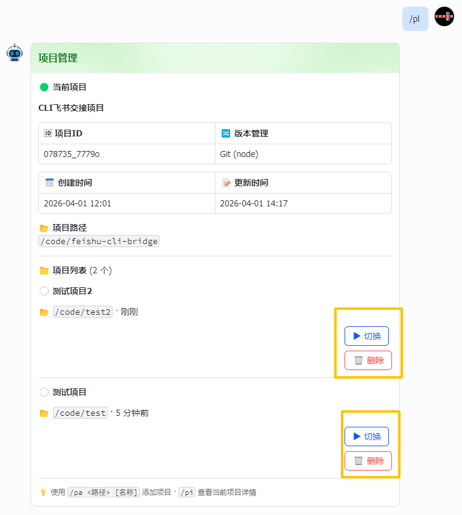

# 问题追踪

## 活跃问题（待修复）

| Issue | 描述 | 优先级 | 相关文件 |
|-------|------|--------|----------|
| #33 | 会话上下文百分比显示始终为 0% | 高 | `src/feishu/card_builder.py`, `src/adapters/opencode.py` |
| #16 | `FeishuClient._parse_message` 解析结果丢弃，重复解析 | 高 | `src/feishu/client.py`, `src/feishu/handler.py` |
| #17 | `_stream_reply_legacy` 丢失 `reply_to` 参数 | 高 | `src/feishu/api.py` |
| #18 | `SessionManager._save_session` 同步阻塞事件循环 | 高 | `src/session/manager.py` |
| #19 | `_patch_card` 每次回调重建 SDK Client | 高 | `src/feishu/client.py` |
| #20 | `handler.py` 重复 TUI 命令检测（死代码） | 高 | `src/feishu/handler.py` |
| #21 | 附件保存路径穿越风险 | 中 | `src/feishu/api.py` |
| #24 | `_beautify_list_items` 是完全空操作 | 中 | `src/feishu/card_builder.py` |
| #25 | `formatter.py` 大量死代码待清理 | 低 | `src/feishu/formatter.py` |

---

## Issue #33 详情

**标题**: 会话上下文百分比显示始终为 0%

**状态**: 🐛 活跃（待修复）

**优先级**: 🔴 高

**影响**: 用户无法实时获取上下文窗口占用率，存在会话上下文污染风险，可能导致模型幻觉加重，影响开发效率。

**现象**:
- AI 回复卡片 Footer 中显示的上下文占用百分比始终为 `0%`（如：📊 422 (0%)）
- 实际 Token 消耗已发生，但百分比计算或传递异常

**相关文件**:
- `src/feishu/card_builder.py` - 卡片 Footer 构建逻辑
- `src/adapters/opencode.py` - Token 统计信息解析与传递
- `src/feishu/api.py` - stream_reply 元数据处理

**可能原因**:
1. OpenCode SSE 事件流中的 `usage` 或 `context` 数据未正确解析
2. Token 统计信息未正确传递到卡片构建器
3. 百分比计算公式错误或分母（上下文窗口大小）获取失败

**截图**: 

---

## 已知问题

### LSP 类型检查误报

**状态**: ⚠️ 已知，不影响运行

VS Code / LSP 显示大量类型错误（如 `"v1" is not a known attribute of "None"`），系 lark_oapi SDK 类型定义不完整所致。仅影响开发体验，不影响实际运行。

---

## 技术决策记录

### Issue #10: /session 命令在飞书客户端下作用有限

**状态**: 🔍 待讨论

**问题描述**: `/session` 命令返回纯文本会话列表，用户回复数字切换。在飞书客户端中存在局限：使用场景稀少、列表不美观、`/new` 已覆盖核心需求。

**暂定决策**: 不做修改，保留现状，等待进一步使用反馈后再决定去留。

---

## 近期已修复（见 CHANGELOG.md 详情）

- **v0.1.8** - Issue #32: 会话改名交互失败、交互式回复卡片空白
- **v0.1.7** - Issue #33-#39: Session 管理重构相关问题（`reset_session` 空目录保护、`storage_dir` 移除、封装修复、代码重复清理等）
- **v0.1.6** - `parse_chunk` 签名修复、`asyncio.get_event_loop()` 弃用用法
- **v0.1.5** - Issue #27-#28: 外部目录权限阻塞、工具调用后无文字回复